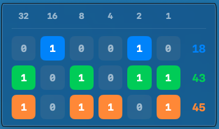

# BinClock

BinClock is a small app for Mac OSX that displays a binary clock: hours, minutes and seconds are displayed as bits, with decimal output on the right side for ease of reading. The above image was taken at 13:24:36.

BinClock uses a "widget-like" display; it stays on top of other windows. But it is just a Mac OSX binary with one (undecorated) output window that will appear on one desktop.

## To build:

- Fork the repo
- `cd` into the directory where `build.sh` resides
- Run `./build.sh` (you will need XCode tools)

## To install:

- Put the resulting binary (something like `.../binclock/.build/arm64-apple-macosx/release/BinClock`, the build script will tell you) into some directory on your `$PATH`.

## To run it:

- Start the resulting binary `BinClock`. Add an ampersand if you are running it from the commandline (or from `cron`) so that it runs in the background. From a terminal, use `nohup BinClock &` so that it continues running after closing said terminal.

## To stop it:

The UI controls are minimal, by design. Kill it from the commandline by running `killall BinClock`.
